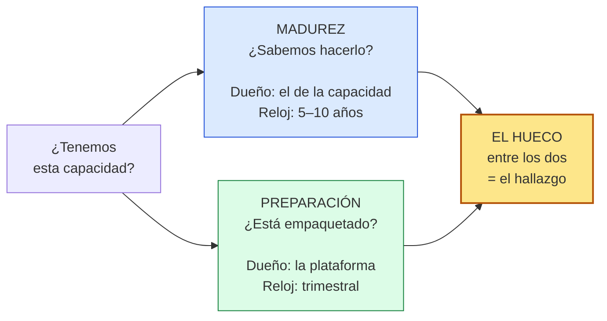
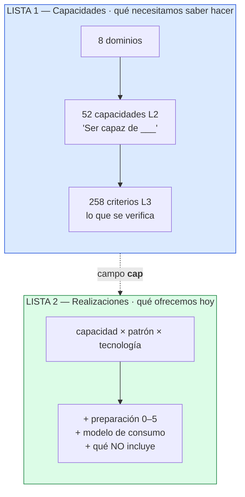
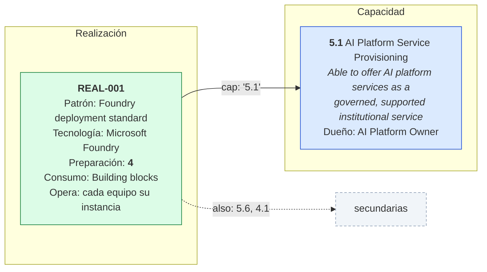
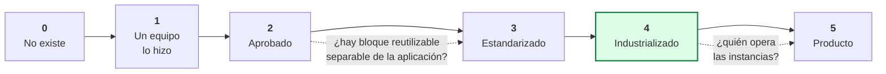
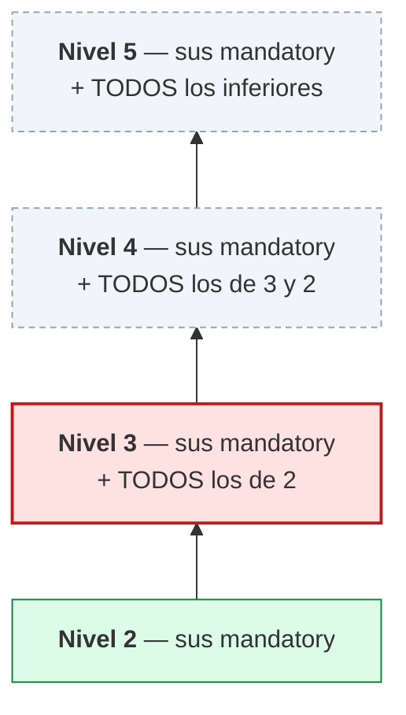
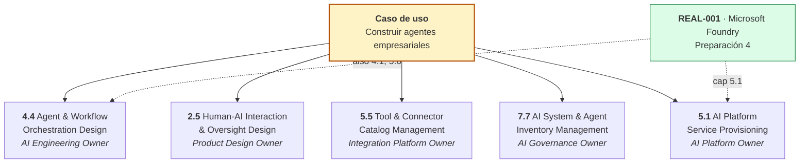
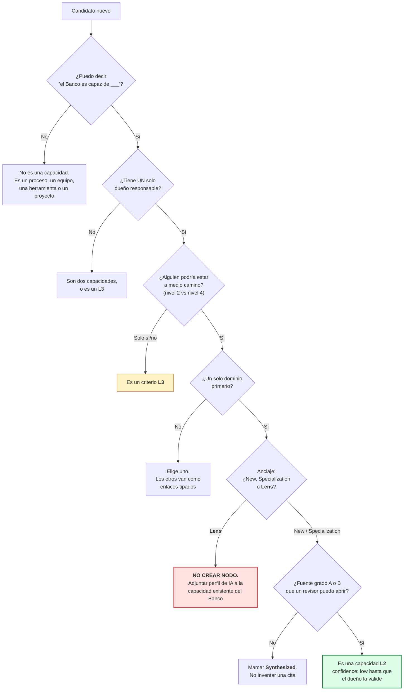

# Cómo funciona el modelo — explicado

**Nota de orientación. No es normativa.** Lo normativo está en
[[../decisions/README|decisions/README.md]] y en `CLAUDE.md`.
Esta nota existe para entenderlo y para poder explicarlo.

Última actualización: 4 de septiembre de 2026

---

## 1. La idea, en una frase

> **Hay dos preguntas distintas, y la respuesta a una no te dice la respuesta a la otra.**

| | La pregunta | Cómo se llama |
|---|---|---|
| 1 | ¿El Banco **sabe hacer** esto? | **Madurez** *(maturity)* |
| 2 | ¿Ya está **empaquetado** para que un equipo lo use? | **Preparación** *(readiness)* |

Todo lo demás en el modelo es consecuencia de esto.

### La analogía del quirófano

Un hospital compra un quirófano nuevo. Completo, moderno, funcionando.

- ¿Está el quirófano listo? **Sí.** → eso es *readiness*.
- ¿El hospital sabe operar corazones? **Es otra pregunta.** → eso es *maturity*.

Comprar el quirófano no te da cirujanos. Ni protocolos. Ni quién revisa los resultados.

**Un modelo con un solo número te deja decir que sí a las dos.** Por eso usamos dos.



Preguntas distintas, dueños distintos, relojes distintos. Por eso **no pueden ser un solo número**.
Esto es la decisión **D1**, y es la que más vale la pena defender.

---

## 2. El caso real: REAL-001

Es la única realización **confirmada** que tenemos hoy. Sirve como ejemplo honesto.

> **Microsoft Foundry**, para construir agentes. **Preparación = 4.**
> Hay módulos de Terraform, línea base de seguridad, CI/CD, repositorios plantilla.
> Un equipo se sirve solo y le funciona. **Está bien empaquetado.**
>
> Lo que **no viene en la caja** (campo `notprov` del registro):
> las reglas de negocio · los datos de anclaje · los criterios de evaluación ·
> el diseño de supervisión humana.
>
> Eso último **es la capacidad**. Y esa está en otro nivel.

Y un punto que desarma la objeción antes de que la hagan:

> **4 es el destino correcto aquí, no una parada intermedia.** Los agentes son por-caso-de-uso
> por naturaleza. El camino de mejora es **enriquecer lo que viene en la caja**, no perseguir el 5.

`notprov` es el campo más importante del registro. Es lo que impide que
*"aprobamos la tecnología"* se convierta en *"tenemos la capacidad"*.

---

## 3. Las dos listas

El modelo son **dos registros separados a propósito** (decisión **D5**).



| | Lista 1 — Capacidades | Lista 2 — Realizaciones |
|---|---|---|
| Qué es | Lo que el Banco necesita saber hacer | Lo que el Banco **realmente** ofrece hoy |
| Menciona proveedores | **No.** Neutral | **Sí.** Con nombre de producto |
| Cambia | Lento — años | Rápido — trimestral |
| Lleva número | Madurez | Preparación |
| Archivo | `model/model3.json` | `model/realization.json` |

**Por qué separadas:** si están en la misma lista, se confunden. Siempre.

---

## 4. Cómo se conectan

Por **un campo**. Uno solo.



- **`cap`** → la **única** capacidad primaria que realiza.
- **`also`** → secundarias, separadas por coma.
- Una realización es el triple **capacidad × patrón × tecnología**.
  Misma capacidad + otra tecnología = **otro registro**. Por eso `REAL-101` y `REAL-102`
  son ambos `cap: 3.6`.
- **La preparación va en la realización. Nunca en el catálogo de capacidades.**

---

## 5. Los niveles de preparación (0–5)

Están en [[readiness-levels-comparators]] con más detalle. Lo que hay que recordar:



**Dos preguntas resuelven cualquier fila** (decisión **D2**):

1. **¿Hay un bloque reutilizable separable de una sola aplicación?** → decide 2 vs 3–4
2. **¿Quién opera las instancias?** → decide 4 vs 5

En REAL-001 el campo dice `operated: "Consumer - each team runs its own instance"`.
Por eso es 4 y no 5.

> **El 5 no es la meta en todos lados.** Decirlo antes de que lo pregunten.

---

## 6. Qué se puntúa, exactamente

La pregunta que más confusión causa. La respuesta corta:

| Objeto | ¿Se puntúa? | Escala |
|---|---|---|
| **L1 — dominio** | **No.** Es un agrupador de reporte, no una unidad de evaluación | — |
| **L2 — capacidad** | **Sí** | Madurez 1–5 (+ estados 0 / NE / UC / NA) |
| **L3 — criterio** | **No lleva número propio** | Cumple / no cumple / no aplica |
| **Realización** | **Sí** | Preparación 0–5 |

**Dos números por línea. Nada se promedia.**

### Los L3 no suman: abren compuertas

> La calificación es **el nivel más alto** para el cual **todo** criterio obligatorio aplicable
> **en ese nivel y en todos los inferiores** está cumplido con evidencia válida.



**Un solo mandatory incumplido en el nivel 3 te deja en 2** — aunque tengas perfectos los cinco
del nivel 4. No hay crédito parcial. No existe el 2,6.

Por eso `CLAUDE.md` prohíbe **promediar o sacar mediana** de un puntaje ordinal.
No es sumable. Es un escalón que se cruza o no se cruza.

Tres tipos de criterio:

- **mandatory** — hace compuerta
- **conditional** — entra a la compuerta **solo si su disparador es cierto**
- **enhancing** — **nunca** compensa un mandatory incumplido

Y una marca aparte: **caps maturity**. Solo un criterio así marcado puede detener una calificación
por motivos de control, por bien que esté todo lo demás.

> [!warning] Hoy esto no se puede ejecutar mecánicamente
> Los 258 criterios L3 **no están tipados** (la columna existe en la hoja 6, vacía).
> Y existe **1 rúbrica de 52**. Mientras tanto la madurez se escribe a mano con criterio experto,
> usando los L3 como lista de verificación, y **debe etiquetarse provisional**.

---

## 7. Ejemplo trabajado: "capacidad de construir agentes empresariales"

### 7.1 Primero — eso no es una capacidad

Suena como una. No lo es: es un **caso de uso**, y atraviesa varias capacidades con dueños distintos.



| La pregunta que en realidad estás haciendo | Capacidad |
|---|---|
| ¿Sabemos **diseñar** qué persigue el agente y dónde para? | **4.4** |
| ¿Sabemos **decidir dónde entra el humano**? | **2.5** |
| ¿Controlamos **qué acciones puede alcanzar**? | **5.5** |
| ¿Sabemos **cuáles corren** y quién responde por cada uno? | **7.7** |
| ¿Ofrecemos **la plataforma** como servicio institucional? | **5.1** |

**Cinco capacidades, cinco dueños. Ninguno responde por los otros cuatro.**

Si «construir agentes» fuera una capacidad, tendría un dueño y una calificación, y cuando el
agente hiciera algo que no debía sabrías a quién llamar. Como no lo es, la pregunta
*«¿tenemos la capacidad de construir agentes?»* **no tiene una respuesta: tiene cinco.**

### 7.2 Puntuemos una de verdad — 4.4

> **4.4 Agent & Workflow Orchestration Design**
> *Able to design what an agent may pursue, how it plans, and where it must stop.*
> Dueño: AI Engineering Owner

Sus seis L3, tipados y escalonados:

| Nivel | L3 | Tipo | Por qué ahí |
|---|---|---|---|
| **2** | 4.4.1 Agent Specification & Goal Definition | mandatory | Sin objetivo y acciones prohibidas escritas *antes* de construir, no hay nada que evaluar |
| **2** | 4.4.6 Termination & Loop Control Design | mandatory · **caps** | Un agente sin condición de parada ni presupuesto es un incidente esperando |
| **3** | 4.4.5 Guardrail & Constraint Design | mandatory · **caps** | Límites duros que el agente no puede razonar para saltarse |
| **3** | 4.4.4 Agent Memory & State Design | mandatory | Qué retiene, cuánto, y **quién más lo ve** — es fuga de datos si no se diseñó |
| **4** | 4.4.2 Task Decomposition & Planning Design | mandatory | Diseñar el plan, no heredar el default del framework |
| **4** | 4.4.3 Multi-Agent Coordination Design | **conditional** | Disparador: *más de un agente en el flujo* |
| **5** | — | mandatory | Ciclo de mejora cerrado: patrón medido → cambio → beneficio verificado |

> [!note] Dos decisiones de juicio, no de derivación
> **4.4.6 va en el nivel 2, no en el 4.** El instinto es poner control de loops arriba porque
> suena sofisticado. Está mal: un agente sin parada es más peligroso que uno sin plan.
> **Los criterios de seguridad van abajo.**
>
> **4.4.3 es conditional.** Un banco con un agente por caso de uso no debe quedar tapado en 3 por
> no tener coordinación multi-agente que no necesita. Sin el disparador, castigarías a quien tomó
> la decisión correcta.
>
> Esto lo firma el dueño de la capacidad. No el arquitecto que arma la rúbrica.

### 7.3 La evaluación

| L3 | Evidencia encontrada | Veredicto |
|---|---|---|
| 4.4.1 | Plantilla de especificación en el repo, usada en 3 de 4 agentes | ✅ |
| 4.4.6 | Los módulos de Terraform traen límite de turnos y presupuesto por defecto | ✅ |
| 4.4.5 | Un equipo tiene guardrails escritos. Los otros tres usan el default de Foundry. **Sin estándar** | ❌ |
| 4.4.4 | Nadie documentó qué retiene el agente ni por cuánto tiempo | ❌ |
| 4.4.2 | — | ❌ |
| 4.4.3 | Un solo agente por flujo → **disparador falso** | ⊘ no aplica |

Se recorre por escalón:

```
Nivel 2 →  4.4.1 ✅   4.4.6 ✅                      →  SE CRUZA
Nivel 3 →  todo lo de 2 ✅  +  4.4.5 ❌  4.4.4 ❌   →  NO SE CRUZA
Nivel 4 →  irrelevante: el 3 no se cruzó
```

### **Madurez 4.4 = 2**

> **No importa que haya evidencia parcial en el nivel 4.** La compuerta del 3 no se cruzó.
> Se queda en 2. Sin crédito parcial, sin promedio, sin «2,6».
>
> Y `4.4.5` está marcado **caps maturity**: aunque todo lo demás fuera perfecto, seguiría
> deteniendo la calificación por motivo de control. Para eso existe esa marca.

### 7.4 Los dos números juntos — aquí paga el modelo

| | Número | Qué dice |
|---|---|---|
| **REAL-001** · Foundry | **Preparación 4** | Terraform, seguridad de base, CI/CD. Un equipo se sirve solo. **Bien empaquetado** |
| **4.4** · Agent Orchestration Design | **Madurez 2** | Sin estándar de guardrails. Sin diseño de memoria |

**Preparación 4, madurez 2.** La plataforma está lista y el Banco todavía no sabe diseñar agentes
con el estándar que necesita.

**No es una contradicción. Es el hallazgo.** Y es literalmente lo que ya dice el campo `notprov`
de REAL-001: reglas de negocio, datos de anclaje, criterios de evaluación, diseño de supervisión
humana — nada de eso viene en la caja.

> **El 4 no está mal. Está haciendo su trabajo.** Solo que su trabajo no es el que la gente cree.

### 7.5 Cómo se muestra

Una línea por capacidad. **Nunca un número solo.**

```
4.4  Agent & Workflow Orchestration Design          AI Engineering Owner
     Madurez      2 ──────  meta 4          (provisional - sin rúbrica aprobada)
     Preparación  4         REAL-001, Microsoft Foundry
     Hueco        Plataforma industrializada, diseño no estandarizado.
                  4.4.5 guardrails: sin estándar institucional  (caps maturity)
                  4.4.4 memoria y estado: sin diseñar
     Acción       Estándar de guardrails + diseño de memoria, dentro de los módulos.
                  Sube 4.4 a 3. No requiere plataforma nueva.
```

Lo último es lo que hace útil el ejercicio: **la acción no es comprar nada.** Es meter dos cosas
en la caja que ya existe. Eso es «enriquecer lo que viene en la caja» dicho con nombres propios.

Y para la pregunta original — *«¿tenemos capacidad de construir agentes?»* — la respuesta honesta
es una tabla de cinco filas con cinco dueños. No un número.

---

## 8. Cómo agregar puntos al modelo

### Primero: ¿es una capacidad (L2) o un criterio (L3)?



**La prueba 3 es la que hace el trabajo real.** La madurez se mide en L2; el L3 es lo que se
verifica para otorgarla. Si algo solo se responde sí/no, es un L3.

### Los dos ejemplos reales (3 de septiembre de 2026)

| Se agregó | Por qué | Prueba que falló en lo existente |
|---|---|---|
| **1.5** AI Ecosystem & Alliance Management | `1.4` era de compras de punta a punta. No tenía dónde poner colaboraciones académicas ni cooperación multilateral — que no son relaciones con proveedores | 1 y 2 |
| **2.6** AI Innovation & Incubation | La experimentación existía solo como `8.6.4`: un L3 **sin dueño y sin nada que evaluar** | 3 |

Y `8.6.4` **se eliminó** al absorberse en `2.6.5` — dejarlo en los dos lugares rompía la prueba 4.

### Para un criterio L3

Bar más bajo, tres pruebas: es **verificable** (un revisor dice cumple / no cumple contra
evidencia) · pertenece a **exactamente un** L2 · no repite a un hermano.
Apuntar a 4–6 por L2 — el modelo va en 258/52 ≈ 5.

> [!warning] Agregar un L3 hoy no mueve ningún puntaje
> Un L3 nuevo entra **sin tipo** (mandatory / conditional / enhancing), así que no participa de
> ninguna compuerta — ver §6. Cambia **qué revisa un revisor**; todavía no cambia un número.
> Al proponerlo, decir además **en qué nivel** debería hacer compuerta y **de qué tipo** sería:
> eso es la mitad del trabajo de la rúbrica, y se pierde si no se escribe en el momento.

### La regla de proceso

**La taxonomía la valida el dueño antes de que se puntúe nada contra ella** (decisión **D9**).
Lo nuevo entra con `confidence: low`. `1.5` y `2.6` están en *low* ahora mismo por esto.

---

## 9. Cómo explicarlo a colegas

Es complejo porque **son dos modelos**. No lo aplanes — **secuéncialo**. Cuatro movimientos, en este orden:

### 1 · Abre con el fracaso que evita, no con la estructura

> «Compramos la plataforma. ¿Tenemos la capacidad?»
>
> La mayoría de los modelos responden eso con un solo número, así que la respuesta sale *sí*.
> Está mal. Nosotros usamos dos.

### 2 · Las dos preguntas

Nunca digas «madurez y preparación» antes de haber dicho esto:

- **Madurez** — *¿puede la institución hacer esto, con qué estándar, con qué evidencia?*
  Dueño: el responsable de la capacidad. Se mueve en 5–10 años.
- **Preparación** — *¿está esto empaquetado lo bastante bien para consumirse?*
  Dueño: la plataforma. Se mueve cada trimestre.

### 3 · Un ejemplo real — REAL-001

El de la sección 2. Completo, incluida la frase de que **4 es la meta correcta**.
Eso desarma el reflejo de «¿por qué no todo es un 5?» antes de que surja.

Si alguien pide ver **cómo sale un número**, usa el ejemplo trabajado de §7 — pero solo si lo
piden. Es la capa que convence a un escéptico técnico y la que aburre a todos los demás.
De §7, lo que más rinde en una sala: **«construir agentes» no es una capacidad, son cinco,
con cinco dueños.** Eso reencuadra la conversación entera.

### 4 · El fin-de-discusión

El desacuerdo recurrente es *«una capacidad significa que yo no tengo que construirlo»*.

**No discutas la palabra.** Esa creencia es sobre el **modelo de consumo**:
Guidance · Building blocks · Reference implementation · Managed platform · Service/API.
Es un **campo registrado** en la realización (decisión **D3**).
Regístralo como tal y la discusión deja de ser definicional.

### Qué dejar fuera de la primera conversación

Anclaje · grados de procedencia · tipos de derivación · los 258 L3.
Son reales y sí importan para la defensibilidad, pero responden a *«¿podemos defender esto ante
Auditoría Interna?»* — que no es la pregunta que nadie está haciendo en la sala.

**Una salvedad sí conviene dejarla visible:** existe **una sola rúbrica**, faltan 51.
Toda calificación es **provisional y debe etiquetarse así**. Mejor dicho por ti que descubierto por ellos.

---

## 10. Tres cosas que evitan un papelón

> [!danger] Un *lens* no es un punto nuevo
> 14 de 52 son *lenses*. Si un candidato es un lens, crear un nodo le deja al Banco
> **dos capacidades de gestión del cambio con dos dueños**. Está bloqueado hasta que
> tengamos el mapa de capacidades existente del Banco.

> [!danger] Los datos ilustrativos son inventados
> `views_data.json` y **todas las realizaciones desde REAL-101** tienen `conf: false`
> y la nota *ILLUSTRATIVE - confirm before use*. Hoy: **1 confirmada de 5**.
> No citarlas. No meterlas en una presentación.

> [!danger] `model/` se edita · `out/` se genera
> Nunca arregles un hallazgo editando un workbook. Arréglalo en el modelo y reconstruye.
> Eso es lo que hace la evaluación defendible en lugar de un conjunto de hojas de cálculo
> que se desalinearon en silencio.

---

## Ver también

- [[readiness-levels-comparators]] — la tabla de niveles 0–5 y qué evidencia establece cada uno
- [[capability-model-comparison]] — por qué nuestro modelo lleva más capacidad técnica
- [[../decisions/README|decisions/README]] — ADR-0001 a ADR-0012, el texto normativo
